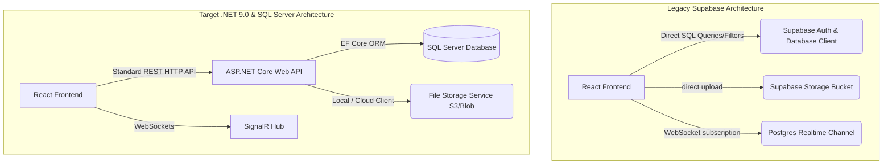
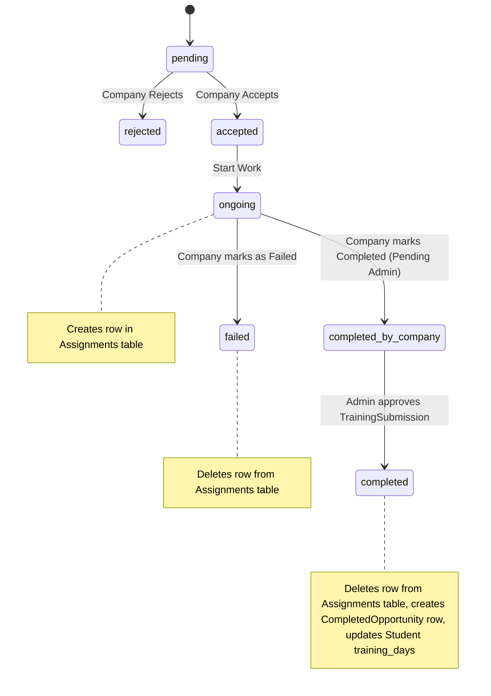

# Master Backend Handoff Blueprint: Supabase to .NET 9.0 & SQL Server Migration

This document serves as the master technical blueprint for the backend engineering team migrating the **Sha8alny** freelance platform for students. It contains the complete architectural, database schema, data contract, and migration guidelines required to replace the client-side Supabase logic with a custom .NET 9.0 Web API and SQL Server database.

---

## 1. Architectural Transition & Migration Goals

The objective of this migration is to replace the current client-side Supabase coupling (direct database queries, authentication sessions, file uploads, and subscriptions) with a secure, scalable, and maintainable backend built using .NET 9.0 and Entity Framework (EF) Core, backed by Microsoft SQL Server.

### Core Architectural Changes



### Key Migration Milestones

1. **Authentication & Identity**: Replace Supabase Auth JWT generation and session management with ASP.NET Core Identity and JWT Bearer authentication.
2. **Database & Schema**: Port the PostgreSQL schema to SQL Server, translating PostgreSQL-specific types (e.g., UUID, JSON, Text arrays) into SQL Server equivalents.
3. **Data Contracts (REST API)**: Expose a structured REST API that implements all the operations currently executed directly as Supabase client-side queries.
4. **Real-Time Communication**: Transition chat and notification Postgres triggers/listeners to ASP.NET Core SignalR.
5. **File Storage**: Migrate profile pictures and uploaded documents from Supabase Storage buckets to a custom upload service (e.g., local storage, AWS S3, or Azure Blob Storage).

---

## 2. Database Schema & SQL Server Type Mappings

Below is the complete database schema mapping for all 20 tables identified in the codebase, detailing the database types, constraints, and relationships.

### PostgreSQL to SQL Server Data Type Mapping Guidelines

| PostgreSQL Type | Recommended SQL Server Type | EF Core Mapping Configuration / Notes |
| :--- | :--- | :--- |
| `serial` / `int` / `bigint` | `INT` / `BIGINT` | `IDENTITY(1,1)` for auto-increment keys. |
| `uuid` | `UNIQUEIDENTIFIER` | Maps to `System.Guid` in C#. |
| `varchar` / `text` | `NVARCHAR(MAX)` or `NVARCHAR(size)` | Use explicit sizes (e.g., `NVARCHAR(256)`) for indexed columns. |
| `boolean` | `BIT` | Maps to `System.Boolean` in C#. |
| `timestamp` / `timestamptz` | `DATETIMEOFFSET` | Preserves timezone offsets. Use `DateTimeOffset` in C#. |
| `text[]` (array) | Normalization (Join Table) | Do not use array columns. Map to a 1-to-many relationship/join table. |

---

### Table Schema Definitions

#### 1. Users (`user`)
Serves as the root account table. Note that in a custom .NET backend, these columns can be merged directly into ASP.NET Core Identity's `AspNetUsers` table or kept as a separate profile table linked via a foreign key.

*   **SQL Schema**:
    ```sql
    CREATE TABLE [dbo].[Users] (
        [Id] INT IDENTITY(1,1) NOT NULL,
        [CreatedAt] DATETIMEOFFSET DEFAULT SYSDATETIMEOFFSET() NOT NULL,
        [FullName] NVARCHAR(256) NOT NULL,
        [PhoneNumber] NVARCHAR(50) NULL,
        [Email] NVARCHAR(256) NOT NULL,
        [Password] NVARCHAR(MAX) NOT NULL, -- Hashed
        [AuthId] UNIQUEIDENTIFIER NULL, -- Links to AspNetUsers.Id if using separate tables
        [UpdatedAt] DATETIMEOFFSET NULL,
        [Role] NVARCHAR(50) NOT NULL CONSTRAINT [DF_Users_Role] DEFAULT 'student', -- 'student', 'company', 'admin'
        [Bio] NVARCHAR(MAX) NULL,
        [ProfilePicture] NVARCHAR(MAX) NULL, -- URL of uploaded avatar
        [FcmToken] NVARCHAR(MAX) NULL, -- Firebase Cloud Messaging token for push notifications
        CONSTRAINT [PK_Users] PRIMARY KEY CLUSTERED ([Id]),
        CONSTRAINT [UK_Users_Email] UNIQUE ([Email])
    );
    CREATE UNIQUE NONCLUSTERED INDEX [IX_Users_AuthId] ON [dbo].[Users]([AuthId]) WHERE [AuthId] IS NOT NULL;
    ```

#### 2. Student Profiles (`student_profile`)
Extends the base user record with student-specific academic information.

*   **SQL Schema**:
    ```sql
    CREATE TABLE [dbo].[StudentProfiles] (
        [Id] INT IDENTITY(1,1) NOT NULL,
        [CreatedAt] DATETIMEOFFSET DEFAULT SYSDATETIMEOFFSET() NOT NULL,
        [University] NVARCHAR(256) NULL,
        [Major] NVARCHAR(256) NULL,
        [GradYear] NVARCHAR(10) NULL,
        [TrainingDays] INT CONSTRAINT [DF_StudentProfiles_TrainingDays] DEFAULT 0 NULL,
        [UserId] INT NOT NULL,
        [CvUrl] NVARCHAR(MAX) NULL,
        [GithubUrl] NVARCHAR(MAX) NULL,
        CONSTRAINT [PK_StudentProfiles] PRIMARY KEY CLUSTERED ([Id]),
        CONSTRAINT [FK_StudentProfiles_Users] FOREIGN KEY ([UserId]) REFERENCES [dbo].[Users] ([Id]) ON DELETE CASCADE
    );
    CREATE UNIQUE NONCLUSTERED INDEX [IX_StudentProfiles_UserId] ON [dbo].[StudentProfiles]([UserId]);
    ```

#### 3. Student Skills (`student_skills`)
A student can have multiple skills. This maps a composite key of the student profile and the skill.

*   **SQL Schema**:
    ```sql
    CREATE TABLE [dbo].[StudentSkills] (
        [StudentId] INT NOT NULL,
        [SkillName] NVARCHAR(100) NOT NULL,
        [CreatedAt] DATETIMEOFFSET DEFAULT SYSDATETIMEOFFSET() NOT NULL,
        CONSTRAINT [PK_StudentSkills] PRIMARY KEY CLUSTERED ([StudentId], [SkillName]),
        CONSTRAINT [FK_StudentSkills_StudentProfiles] FOREIGN KEY ([StudentId]) REFERENCES [dbo].[StudentProfiles] ([Id]) ON DELETE CASCADE
    );
    ```

#### 4. Company Profiles (`company_profile`)
Extends the base user record with corporate details.

*   **SQL Schema**:
    ```sql
    CREATE TABLE [dbo].[CompanyProfiles] (
        [Id] INT IDENTITY(1,1) NOT NULL,
        [CreatedAt] DATETIMEOFFSET DEFAULT SYSDATETIMEOFFSET() NOT NULL,
        [Website] NVARCHAR(MAX) NULL,
        [Industry] NVARCHAR(256) NULL,
        [Description] NVARCHAR(MAX) NULL,
        [UserId] INT NOT NULL,
        CONSTRAINT [PK_CompanyProfiles] PRIMARY KEY CLUSTERED ([Id]),
        CONSTRAINT [FK_CompanyProfiles_Users] FOREIGN KEY ([UserId]) REFERENCES [dbo].[Users] ([Id]) ON DELETE CASCADE
    );
    CREATE UNIQUE NONCLUSTERED INDEX [IX_CompanyProfiles_UserId] ON [dbo].[CompanyProfiles]([UserId]);
    ```

#### 5. Opportunities / Projects (`opportunity`)
Job offers, internships, or freelance projects posted by companies.

*   **SQL Schema**:
    ```sql
    CREATE TABLE [dbo].[Opportunities] (
        [Id] INT IDENTITY(1,1) NOT NULL,
        [CreatedAt] DATETIMEOFFSET DEFAULT SYSDATETIMEOFFSET() NOT NULL,
        [Title] NVARCHAR(256) NOT NULL,
        [Type] NVARCHAR(256) NULL, -- Contains both Job Type and Location Type space-separated (e.g. 'Internship Remote')
        [Description] NVARCHAR(MAX) NULL,
        [Requirements] NVARCHAR(MAX) NULL, -- Tag names, space-separated string (e.g., 'React C# SQL')
        [Deadline] DATETIMEOFFSET NULL,
        [IsPaid] BIT CONSTRAINT [DF_Opportunities_IsPaid] DEFAULT 0 NULL,
        [AmountOfMoney] DECIMAL(18,2) CONSTRAINT [DF_Opportunities_AmountOfMoney] DEFAULT 0.00 NULL,
        [Duration] INT NULL, -- Duration in days
        [CompanyId] INT NULL, -- References CompanyProfiles.Id
        [ImageUrl] NVARCHAR(MAX) NULL,
        CONSTRAINT [PK_Opportunities] PRIMARY KEY CLUSTERED ([Id]),
        CONSTRAINT [FK_Opportunities_CompanyProfiles] FOREIGN KEY ([CompanyId]) REFERENCES [dbo].[CompanyProfiles] ([Id]) ON DELETE SET NULL
    );
    ```

#### 6. Applications (`application`)
Student applications to opportunities.

*   **SQL Schema**:
    ```sql
    CREATE TABLE [dbo].[Applications] (
        [Id] INT IDENTITY(1,1) NOT NULL,
        [CreatedAt] DATETIMEOFFSET DEFAULT SYSDATETIMEOFFSET() NOT NULL,
        [Status] NVARCHAR(50) CONSTRAINT [DF_Applications_Status] DEFAULT 'pending' NOT NULL, 
        -- Status options: 'pending', 'accepted', 'rejected', 'ongoing', 'completed_by_company', 'completed', 'failed', 'in_review'
        [OpportunityId] INT NOT NULL,
        [StudentId] INT NOT NULL, -- References StudentProfiles.Id
        [Cv] NVARCHAR(MAX) NULL, -- Custom CV URL submitted for this application
        [Proposal] NVARCHAR(MAX) NULL, -- Proposal text or external link
        [Notes] NVARCHAR(MAX) NULL, -- Feedback/internal notes
        CONSTRAINT [PK_Applications] PRIMARY KEY CLUSTERED ([Id]),
        CONSTRAINT [FK_Applications_Opportunities] FOREIGN KEY ([OpportunityId]) REFERENCES [dbo].[Opportunities] ([Id]) ON DELETE CASCADE,
        CONSTRAINT [FK_Applications_StudentProfiles] FOREIGN KEY ([StudentId]) REFERENCES [dbo].[StudentProfiles] ([Id]) ON DELETE CASCADE
    );
    CREATE NONCLUSTERED INDEX [IX_Applications_OpportunityId] ON [dbo].[Applications]([OpportunityId]);
    CREATE NONCLUSTERED INDEX [IX_Applications_StudentId] ON [dbo].[Applications]([StudentId]);
    ```

#### 7. Assignments (`assignment`)
Stores active projects currently assigned to students (ongoing work).

*   **SQL Schema**:
    ```sql
    CREATE TABLE [dbo].[Assignments] (
        [Id] INT IDENTITY(1,1) NOT NULL,
        [CreatedAt] DATETIMEOFFSET DEFAULT SYSDATETIMEOFFSET() NOT NULL,
        [StudentId] INT NOT NULL, -- References StudentProfiles.Id
        [OpportunityId] INT NOT NULL, -- References Opportunities.Id
        CONSTRAINT [PK_Assignments] PRIMARY KEY CLUSTERED ([Id]),
        CONSTRAINT [FK_Assignments_StudentProfiles] FOREIGN KEY ([StudentId]) REFERENCES [dbo].[StudentProfiles] ([Id]) ON DELETE CASCADE,
        CONSTRAINT [FK_Assignments_Opportunities] FOREIGN KEY ([OpportunityId]) REFERENCES [dbo].[Opportunities] ([Id]) ON DELETE NO ACTION
    );
    CREATE UNIQUE NONCLUSTERED INDEX [IX_Assignments_Student_Opportunity] ON [dbo].[Assignments]([StudentId], [OpportunityId]);
    ```

#### 8. Completed Opportunities (`completed_opportunity`)
Finalized projects requiring student, company, or payment approvals.

*   **SQL Schema**:
    ```sql
    CREATE TABLE [dbo].[CompletedOpportunities] (
        [Id] INT IDENTITY(1,1) NOT NULL,
        [CreatedAt] DATETIMEOFFSET DEFAULT SYSDATETIMEOFFSET() NOT NULL,
        [ConfirmedByStudent] BIT CONSTRAINT [DF_CompletedOpp_Student] DEFAULT 0 NULL,
        [ConfirmedByCompany] BIT CONSTRAINT [DF_CompletedOpp_Company] DEFAULT 0 NULL,
        [ConfirmedByPayment] BIT CONSTRAINT [DF_CompletedOpp_Payment] DEFAULT 0 NULL,
        [StudentId] INT NOT NULL, -- References StudentProfiles.Id
        [OpportunityId] INT NOT NULL, -- References Opportunities.Id
        CONSTRAINT [PK_CompletedOpportunities] PRIMARY KEY CLUSTERED ([Id]),
        CONSTRAINT [FK_CompletedOpportunities_StudentProfiles] FOREIGN KEY ([StudentId]) REFERENCES [dbo].[StudentProfiles] ([Id]) ON DELETE CASCADE,
        CONSTRAINT [FK_CompletedOpportunities_Opportunities] FOREIGN KEY ([OpportunityId]) REFERENCES [dbo].[Opportunities] ([Id]) ON DELETE NO ACTION
    );
    ```

#### 9. Training Submissions (`training_submissions`)
Holds student certificate and report submissions for training hours verification.

*   **SQL Schema**:
    ```sql
    CREATE TABLE [dbo].[TrainingSubmissions] (
        [Id] INT IDENTITY(1,1) NOT NULL,
        [CreatedAt] DATETIMEOFFSET DEFAULT SYSDATETIMEOFFSET() NOT NULL,
        [StudentId] INT NOT NULL, -- References StudentProfiles.Id
        [TrainingId] INT NOT NULL, -- References Opportunities.Id
        [Status] NVARCHAR(50) CONSTRAINT [DF_TrainingSubmissions_Status] DEFAULT 'pending' NOT NULL, -- 'pending', 'approved', 'rejected'
        [CertificateUrl] NVARCHAR(MAX) NULL,
        [ReportUrl] NVARCHAR(MAX) NULL,
        [PresentationUrl] NVARCHAR(MAX) NULL,
        [CompanyEvaluationUrl] NVARCHAR(MAX) NULL,
        [StudentSurveyUrl] NVARCHAR(MAX) NULL,
        [AdminNotes] NVARCHAR(MAX) NULL, -- rejection notes
        CONSTRAINT [PK_TrainingSubmissions] PRIMARY KEY CLUSTERED ([Id]),
        CONSTRAINT [FK_TrainingSubmissions_StudentProfiles] FOREIGN KEY ([StudentId]) REFERENCES [dbo].[StudentProfiles] ([Id]) ON DELETE CASCADE,
        CONSTRAINT [FK_TrainingSubmissions_Opportunities] FOREIGN KEY ([TrainingId]) REFERENCES [dbo].[Opportunities] ([Id]) ON DELETE NO ACTION
    );
    CREATE NONCLUSTERED INDEX [IX_TrainingSubmissions_StudentId] ON [dbo].[TrainingSubmissions]([StudentId]);
    ```

#### 10. Announcements (`announcement`)
Platform-wide news updates posted by admins.

*   **SQL Schema**:
    ```sql
    CREATE TABLE [dbo].[Announcements] (
        [Id] INT IDENTITY(1,1) NOT NULL,
        [CreatedAt] DATETIMEOFFSET DEFAULT SYSDATETIMEOFFSET() NOT NULL,
        [Title] NVARCHAR(256) NOT NULL,
        [Description] NVARCHAR(MAX) NULL,
        [Link] NVARCHAR(MAX) NULL,
        [ImageUrl] NVARCHAR(MAX) NULL,
        CONSTRAINT [PK_Announcements] PRIMARY KEY CLUSTERED ([Id])
    );
    ```

#### 11. Chats (`chats`)
High-level conversation thread metadata.

*   **SQL Schema**:
    ```sql
    CREATE TABLE [dbo].[Chats] (
        [Id] INT IDENTITY(1,1) NOT NULL,
        [CreatedAt] DATETIMEOFFSET DEFAULT SYSDATETIMEOFFSET() NOT NULL,
        [LastMessage] NVARCHAR(MAX) NULL,
        [LastMessageTime] DATETIMEOFFSET NULL,
        [UnreadCount] INT CONSTRAINT [DF_Chats_UnreadCount] DEFAULT 0 NOT NULL,
        CONSTRAINT [PK_Chats] PRIMARY KEY CLUSTERED ([Id])
    );
    ```

#### 12. Chat Participants (`chat_participants`)
*Normalization for array column `chats.participants`*. Resolves many-to-many relationship between `Chats` and `Users`.

*   **SQL Schema**:
    ```sql
    CREATE TABLE [dbo].[ChatParticipants] (
        [ChatId] INT NOT NULL,
        [UserId] INT NOT NULL,
        [JoinedAt] DATETIMEOFFSET DEFAULT SYSDATETIMEOFFSET() NOT NULL,
        CONSTRAINT [PK_ChatParticipants] PRIMARY KEY CLUSTERED ([ChatId], [UserId]),
        CONSTRAINT [FK_ChatParticipants_Chats] FOREIGN KEY ([ChatId]) REFERENCES [dbo].[Chats] ([Id]) ON DELETE CASCADE,
        CONSTRAINT [FK_ChatParticipants_Users] FOREIGN KEY ([UserId]) REFERENCES [dbo].[Users] ([Id]) ON DELETE CASCADE
    );
    ```

#### 13. Messages (`messages`)
Individual messages sent within a chat session.

*   **SQL Schema**:
    ```sql
    CREATE TABLE [dbo].[Messages] (
        [Id] INT IDENTITY(1,1) NOT NULL,
        [CreatedAt] DATETIMEOFFSET DEFAULT SYSDATETIMEOFFSET() NOT NULL,
        [Content] NVARCHAR(MAX) NOT NULL,
        [SenderId] INT NOT NULL, -- References Users.Id
        [IsRead] BIT CONSTRAINT [DF_Messages_IsRead] DEFAULT 0 NOT NULL,
        [ChatId] INT NOT NULL, -- References Chats.Id
        CONSTRAINT [PK_Messages] PRIMARY KEY CLUSTERED ([Id]),
        CONSTRAINT [FK_Messages_Users] FOREIGN KEY ([SenderId]) REFERENCES [dbo].[Users] ([Id]) ON DELETE NO ACTION,
        CONSTRAINT [FK_Messages_Chats] FOREIGN KEY ([ChatId]) REFERENCES [dbo].[Chats] ([Id]) ON DELETE CASCADE
    );
    CREATE NONCLUSTERED INDEX [IX_Messages_ChatId] ON [dbo].[Messages]([ChatId]);
    ```

#### 14. Notifications (`notifications`)
User system-level alerts.

*   **SQL Schema**:
    ```sql
    CREATE TABLE [dbo].[Notifications] (
        [Id] INT IDENTITY(1,1) NOT NULL,
        [CreatedAt] DATETIMEOFFSET DEFAULT SYSDATETIMEOFFSET() NOT NULL,
        [Title] NVARCHAR(256) NULL,
        [Body] NVARCHAR(MAX) NULL,
        [IsRead] BIT CONSTRAINT [DF_Notifications_IsRead] DEFAULT 0 NULL,
        [UserId] INT NOT NULL, -- References Users.Id
        CONSTRAINT [PK_Notifications] PRIMARY KEY CLUSTERED ([Id]),
        CONSTRAINT [FK_Notifications_Users] FOREIGN KEY ([UserId]) REFERENCES [dbo].[Users] ([Id]) ON DELETE CASCADE
    );
    ```

#### 15. Application Configuration (`app_config`)
Global system maintenance flags and min versions.

*   **SQL Schema**:
    ```sql
    CREATE TABLE [dbo].[AppConfigs] (
        [Id] INT IDENTITY(1,1) NOT NULL,
        [CreatedAt] DATETIMEOFFSET DEFAULT SYSDATETIMEOFFSET() NOT NULL,
        [IsMaintenanceMode] BIT CONSTRAINT [DF_AppConfigs_Maintenance] DEFAULT 0 NULL,
        [MaintenanceMessage] NVARCHAR(MAX) NULL,
        [MaintenanceTitle] NVARCHAR(256) NULL,
        [MinSupportedVersion] NVARCHAR(50) NULL,
        CONSTRAINT [PK_AppConfigs] PRIMARY KEY CLUSTERED ([Id])
    );
    ```

#### 16. Categories (`categories`)
Job categories linked to opportunities.

*   **SQL Schema**:
    ```sql
    CREATE TABLE [dbo].[Categories] (
        [Id] INT IDENTITY(1,1) NOT NULL,
        [CreatedAt] DATETIMEOFFSET DEFAULT SYSDATETIMEOFFSET() NOT NULL,
        [Name] NVARCHAR(256) NULL,
        [IconUrl] NVARCHAR(MAX) NULL,
        [Description] NVARCHAR(MAX) NULL,
        [OpportunityId] INT NULL, -- References Opportunities.Id
        CONSTRAINT [PK_Categories] PRIMARY KEY CLUSTERED ([Id]),
        CONSTRAINT [FK_Categories_Opportunities] FOREIGN KEY ([OpportunityId]) REFERENCES [dbo].[Opportunities] ([Id]) ON DELETE SET NULL
    );
    ```

#### 17. Modules (`modules`)
Milestones or parts of an opportunity.

*   **SQL Schema**:
    ```sql
    CREATE TABLE [dbo].[Modules] (
        [Id] INT IDENTITY(1,1) NOT NULL,
        [CreatedAt] DATETIMEOFFSET DEFAULT SYSDATETIMEOFFSET() NOT NULL,
        [OpportunityId] INT NOT NULL, -- References Opportunities.Id
        [Title] NVARCHAR(256) NOT NULL,
        [Description] NVARCHAR(MAX) NOT NULL,
        [Duration] INT NULL, -- Duration in hours/days
        CONSTRAINT [PK_Modules] PRIMARY KEY CLUSTERED ([Id]),
        CONSTRAINT [FK_Modules_Opportunities] FOREIGN KEY ([OpportunityId]) REFERENCES [dbo].[Opportunities] ([Id]) ON DELETE CASCADE
    );
    ```

#### 18. Completed Modules (`completed_modules`)
Tracks student progress on individual modules.

*   **SQL Schema**:
    ```sql
    CREATE TABLE [dbo].[CompletedModules] (
        [Id] INT IDENTITY(1,1) NOT NULL,
        [CreatedAt] DATETIMEOFFSET DEFAULT SYSDATETIMEOFFSET() NOT NULL,
        [StudentId] INT NOT NULL, -- References StudentProfiles.Id
        [ModuleId] INT NOT NULL, -- References Modules.Id
        CONSTRAINT [PK_CompletedModules] PRIMARY KEY CLUSTERED ([Id]),
        CONSTRAINT [FK_CompletedModules_StudentProfiles] FOREIGN KEY ([StudentId]) REFERENCES [dbo].[StudentProfiles] ([Id]) ON DELETE CASCADE,
        CONSTRAINT [FK_CompletedModules_Modules] FOREIGN KEY ([ModuleId]) REFERENCES [dbo].[Modules] ([Id]) ON DELETE NO ACTION
    );
    ```

#### 19. Payments (`payment`)
Financial transaction ledger records.

*   **SQL Schema**:
    ```sql
    CREATE TABLE [dbo].[Payments] (
        [Id] INT IDENTITY(1,1) NOT NULL,
        [PaidAt] DATETIMEOFFSET DEFAULT SYSDATETIMEOFFSET() NOT NULL,
        [Amount] DECIMAL(18,2) NULL,
        [Currency] NVARCHAR(10) NULL,
        [Type] NVARCHAR(50) NULL, -- 'milestone', 'upfront', 'final'
        [Method] NVARCHAR(50) NULL, -- 'card', 'paypal', 'bank_transfer'
        [Status] NVARCHAR(50) NULL, -- 'success', 'pending', 'failed'
        [TotalInstallment] INT NULL,
        [InstallmentNumber] INT NULL,
        [SenderId] INT NULL, -- References Users.Id
        [ReceiverId] INT NULL, -- References Users.Id
        [CompletedOppId] INT NULL, -- References CompletedOpportunities.Id
        CONSTRAINT [PK_Payments] PRIMARY KEY CLUSTERED ([Id]),
        CONSTRAINT [FK_Payments_Sender] FOREIGN KEY ([SenderId]) REFERENCES [dbo].[Users] ([Id]) ON DELETE NO ACTION,
        CONSTRAINT [FK_Payments_Receiver] FOREIGN KEY ([ReceiverId]) REFERENCES [dbo].[Users] ([Id]) ON DELETE NO ACTION,
        CONSTRAINT [FK_Payments_CompletedOpp] FOREIGN KEY ([CompletedOppId]) REFERENCES [dbo].[CompletedOpportunities] ([Id]) ON DELETE SET NULL
    );
    ```

#### 20. Reviews (`review`)
Contract feedback evaluations.

*   **SQL Schema**:
    ```sql
    CREATE TABLE [dbo].[Reviews] (
        [Id] INT IDENTITY(1,1) NOT NULL,
        [CreatedAt] DATETIMEOFFSET DEFAULT SYSDATETIMEOFFSET() NOT NULL,
        [Rating] INT NULL, -- e.g., 1 to 5
        [Comment] NVARCHAR(MAX) NULL,
        [ReviewerId] INT NULL, -- References Users.Id (uid_review)
        [TargetId] INT NULL, -- References Users.Id (uid_target)
        [CompletedOppId] INT NULL, -- References CompletedOpportunities.Id
        CONSTRAINT [PK_Reviews] PRIMARY KEY CLUSTERED ([Id]),
        CONSTRAINT [FK_Reviews_Reviewer] FOREIGN KEY ([ReviewerId]) REFERENCES [dbo].[Users] ([Id]) ON DELETE NO ACTION,
        CONSTRAINT [FK_Reviews_Target] FOREIGN KEY ([TargetId]) REFERENCES [dbo].[Users] ([Id]) ON DELETE NO ACTION,
        CONSTRAINT [FK_Reviews_CompletedOpp] FOREIGN KEY ([CompletedOppId]) REFERENCES [dbo].[CompletedOpportunities] ([Id]) ON DELETE SET NULL
    );
    ```

#### 21. Saved Opportunities (`saved_opportunities`)
Bookmarks for projects.

*   **SQL Schema**:
    ```sql
    CREATE TABLE [dbo].[SavedOpportunities] (
        [Id] INT IDENTITY(1,1) NOT NULL,
        [CreatedAt] DATETIMEOFFSET DEFAULT SYSDATETIMEOFFSET() NOT NULL,
        [UserId] INT NOT NULL, -- References Users.Id
        [OpportunityId] INT NOT NULL, -- References Opportunities.Id
        CONSTRAINT [PK_SavedOpportunities] PRIMARY KEY CLUSTERED ([Id]),
        CONSTRAINT [FK_SavedOpportunities_Users] FOREIGN KEY ([UserId]) REFERENCES [dbo].[Users] ([Id]) ON DELETE CASCADE,
        CONSTRAINT [FK_SavedOpportunities_Opportunities] FOREIGN KEY ([OpportunityId]) REFERENCES [dbo].[Opportunities] ([Id]) ON DELETE NO ACTION
    );
    ```

---

## 3. Data Contracts & REST API Mapping

Direct Supabase calls in React pages must be replaced by calls to a structured ASP.NET Web API. Below is the mapping of components/views to backend endpoints.

### Authentication Endpoints

*   **`POST /api/auth/register`**
    *   **Description**: Creates a new User and corresponding Profile.
    *   **Payload**:
        ```json
        {
          "email": "user@domain.com",
          "password": "SecurePassword123!",
          "fullName": "Jane Doe",
          "role": "company" // 'company' or 'student'
        }
        ```
    *   **Response**: `200 OK`
        ```json
        {
          "token": "eyJhbGciOi...",
          "user": { "id": 1, "fullName": "Jane Doe", "email": "user@domain.com", "role": "company" }
        }
        ```

*   **`POST /api/auth/login`**
    *   **Description**: Validates credentials and returns JWT bearer token.
    *   **Payload**:
        ```json
        {
          "email": "user@domain.com",
          "password": "SecurePassword123!"
        }
        ```
    *   **Response**: `200 OK` containing JWT and User/Profile metadata.

---

### Dashboard & Analytics Endpoints

*   **`GET /api/dashboard/stats`**
    *   **Description**: Fetches aggregations for Company Dashboard view (`Dashboard.tsx`).
    *   **Authorization**: Roles `company`, `admin`
    *   **Response**:
        ```json
        {
          "totalStudents": 450,
          "completedProjects": 12,
          "opportunities": 4,
          "totalProjects": 8
        }
        ```

*   **`GET /api/dashboard/recent-applications`**
    *   **Description**: Fetches top 5 recent applications.
    *   **Response**: Array of:
        ```json
        {
          "applicantName": "John Doe",
          "status": "pending"
        }
        ```

---

### Opportunities & Projects Endpoints

*   **`GET /api/opportunities`**
    *   **Description**: Queries and filters active opportunities.
    *   **Parameters**: `search` (string), `type` (string), `location` (string), `paidOnly` (bool), `companyId` (int)
    *   **Response**: List of Opportunity objects containing related company name.

*   **`POST /api/opportunities`**
    *   **Description**: Publishes a new project/opportunity.
    *   **Authorization**: Roles `company`, `admin`
    *   **Payload**:
        ```json
        {
          "title": "React Native Mobile App",
          "type": "Contract Remote",
          "description": "Develop client app...",
          "requirements": "React Native Typescript Redux",
          "amountOfMoney": 1500.00,
          "deadline": "2026-08-01T00:00:00Z",
          "duration": 45,
          "imageUrl": "https://cdn.domain.com/proj.png"
        }
        ```

*   **`PUT /api/opportunities/{id}`** / **`DELETE /api/opportunities/{id}`**
    *   **Description**: Updates or deletes an opportunity.

---

### Applications & Assignments Endpoints

*   **`GET /api/applications/company`**
    *   **Description**: Fetches applicants applying for projects owned by the authenticated company.
    *   **Response**: Detailed applicant cards containing student profiles, university, CV link, and skills.

*   **`PUT /api/applications/{id}/status`**
    *   **Description**: Progresses application states. Triggers downstream tables (see Section 5).
    *   **Payload**:
        ```json
        {
          "status": "ongoing" // 'accepted', 'rejected', 'ongoing', 'completed', 'failed'
        }
        ```

---

### Training & Submissions Endpoints (Admin)

*   **`GET /api/admin/training-submissions`**
    *   **Description**: Returns pending training evaluations.
    *   **Authorization**: Role `admin`

*   **`PUT /api/admin/training-submissions/{id}/evaluate`**
    *   **Description**: Admin action to approve or reject student documents.
    *   **Payload**:
        ```json
        {
          "status": "approved", -- 'approved' or 'rejected'
          "adminNotes": "The certificate looks authentic."
        }
        ```

---

### Messaging & Signals (SignalR Hubs)

Direct PostgreSQL client subscriptions on `chats` and `messages` tables must transition to **ASP.NET Core SignalR**.

*   **`ChatHub` (`/hubs/chat`)**
    *   Clients subscribe to `SendMessage` and `ReceiveMessage` invocations.
    *   On message sent (`POST /api/messages` or Hub invocation), server-side broadcast distributes the message model to the recipient connection ID or group.

```
React Client (Chat UI)  <---- WebSockets (SignalR) ---->  ASP.NET Core ChatHub  ---->  SQL Server (Write DB)
```

---

## 4. Authentication & Authorization Strategy

We must replace direct Supabase Auth tokens with standard JWT Bearer authentication.

```
Frontend Request (Header: "Authorization: Bearer <JWT>") ---> JWT Middleware (Validate Signatures & Claims) ---> Policy Evaluator (Role validation) ---> Controller Action
```

### Identity Table Merging Design

You can leverage ASP.NET Core Identity's built-in authentication tables by extending `IdentityUser<int>` inside your application `DbContext`:

```csharp
public class ApplicationUser : IdentityUser<int>
{
    public string FullName { get; set; } = null!;
    public string Role { get; set; } = "student";
    public string? Bio { get; set; }
    public string? ProfilePicture { get; set; }
    public string? FcmToken { get; set; }
    public DateTimeOffset CreatedAt { get; set; } = DateTimeOffset.UtcNow;
    public DateTimeOffset? UpdatedAt { get; set; }
    
    // Navigation Properties
    public virtual StudentProfile? StudentProfile { get; set; }
    public virtual CompanyProfile? CompanyProfile { get; set; }
}
```

### JWT Claims Schema
The generated token must contain the following claims to maintain compatibility with client expectations:
*   `sub` / `NameIdentifier`: User Primary Key (`id`).
*   `email`: User's registered email address.
*   `role`: User permission level (`admin`, `company`, `student`).
*   `companyId` (Optional): The mapped company profile identifier (for rapid context reading).

---

## 5. Business Logic & Complex State Transitions (Edge Cases)

The application features several critical state-machine flows that must be executed transactionally on the server using **Entity Framework Core Database Transactions**.

### 1. Application Status Flow & Assignment Lifecycle

When a company user updates the status of an application, several cascading actions are triggered:



#### Application Transition Rules:
*   **Ongoing**: Updating application status to `ongoing` must insert a row into the `dbo.Assignments` table referencing the `StudentId` and `OpportunityId`.
*   **Failed**: Updating status to `failed` must remove the student from the `dbo.Assignments` table.
*   **Completed**:
    1.  If the company submits a status of `completed`, the backend must first query the state of the student's `dbo.TrainingSubmissions` for that opportunity (`TrainingId = OpportunityId`).
    2.  If the submission status is not yet `approved`, the application status must be written to `completed_by_company` instead of `completed`, and the student continues to appear under assignments.
    3.  If the submission **is** `approved`, the flow transitions immediately to full completion (see below).

---

### 2. Admin Training Submission Evaluation & Days Addition

When an administrator approves a student's training submission:

```csharp
using (var transaction = await _dbContext.Database.BeginTransactionAsync())
{
    try
    {
        // 1. Update TrainingSubmission record status to 'approved'
        submission.Status = "approved";
        
        // 2. Fetch associated Application
        var app = await _dbContext.Applications
            .FirstOrDefaultAsync(a => a.StudentId == submission.StudentId && a.OpportunityId == submission.TrainingId);
            
        if (app != null && app.Status == "completed_by_company")
        {
            // 3. Finalize application status
            app.Status = "completed";
            
            // 4. Move to Completed Opportunities ledger
            _dbContext.CompletedOpportunities.Add(new CompletedOpportunity {
                StudentId = submission.StudentId,
                OpportunityId = submission.TrainingId,
                ConfirmedByCompany = true,
                ConfirmedByStudent = true,
                ConfirmedByPayment = false
            });
            
            // 5. Update Student profile hours/days
            var opportunity = await _dbContext.Opportunities.FindAsync(submission.TrainingId);
            var student = await _dbContext.StudentProfiles.FindAsync(submission.StudentId);
            if (opportunity?.Duration != null && student != null)
            {
                student.TrainingDays += opportunity.Duration.Value;
            }
            
            // 6. Delete from active assignments
            var assignment = await _dbContext.Assignments
                .FirstOrDefaultAsync(a => a.StudentId == submission.StudentId && a.OpportunityId == submission.TrainingId);
            if (assignment != null)
            {
                _dbContext.Remove(assignment);
            }
        }
        
        await _dbContext.SaveChangesAsync();
        await transaction.CommitAsync();
    }
    catch
    {
        await transaction.RollbackAsync();
        throw;
    }
}
```

---

## 6. File Storage Migration Plan

The legacy frontend uploads documents and avatars to Supabase Storage inside the `profile_pictures` bucket.

### Rebuilding File Storage in .NET
All frontend files should be uploaded via a unified controller endpoint:
`POST /api/storage/upload` (Form-data: File, context: profile or cv).

#### Backend Options for File Storage:
1.  **Local Storage (On-Premises)**: Saves files directly to a folder in the application root (e.g., `wwwroot/uploads`). Keep absolute paths saved as relative paths in SQL Server (e.g. `/uploads/project-123.png`) and resolve dynamically.
2.  **Cloud Storage (AWS S3 or Azure Blob)**: Replaces Supabase Storage with standard cloud buckets. The backend returns the public URL generated by the storage client (e.g. S3 Public Presigned URL or Azure CDN Endpoint).

```
Frontend Form (File) ---> /api/storage/upload ---> Local Directory or AWS S3 Client ---> Public URL returned in JSON ---> User updates Profile with new URL
```

---

## 7. Legacy Database Migration & Seeding Strategy

To ensure a smooth migration of existing environments and metadata:

### 1. Extracting Legacy Data
1.  Connect to your legacy Supabase PostgreSQL database using an external SQL Tool (pgAdmin, DBeaver).
2.  Execute CSV exports for each table, starting with the baseline user catalogs to preserve constraints.
3.  Clean foreign keys inside the exported files to map correctly to SQL Server auto-incremental fields.

### 2. Entity Framework Core Migration
Initialize the database context using EF Core commands in the Web API directory:
```bash
dotnet ef migrations add InitialMigration
dotnet ef database update
```

### 3. Data Seeding Rules
Configure seeding directly in `DbContext.OnModelCreating`:
*   **Configuration Metadata**: Populate `dbo.AppConfigs` with default configuration metrics (maintenance state = false).
*   **Core Categories**: Inject defaults like Web Dev, Flutter, cybersecurity, marketing, testing, and UI/UX design.
*   **System Admin Account**: Seed a default administrator user account with a strong password hash to ensure initial platform operations can proceed immediately:
    *   **Email**: `admin@sha8alny.com`
    *   **Password**: `Admin@2026!` (Must be hashed using `PasswordHasher<ApplicationUser>`)
    *   **Role**: `admin`

---

## 8. Frontend Modifications Checklist (API Redirection)

After backend completion, the frontend requires the following updates to redirect queries away from Supabase:

1.  **Axios / Fetch Client Setup**: Create a central HTTP client in `@/lib/api.ts` configured with base URL, request interceptors (attaching `Bearer <token>` from localStorage), and global response handling.
2.  **Supabase Client Replacement**:
    *   Search all `.tsx` and `.ts` files for references import `supabase`.
    *   Replace `useQuery` query functions that directly read `supabase.from(...)` with standard async API calls (e.g., `apiClient.get(...)`).
3.  **State Management & Sign In**: Update login routines inside `Auth.tsx` and profile contexts to store the JWT string and user roles inside localStorage or memory variables.
